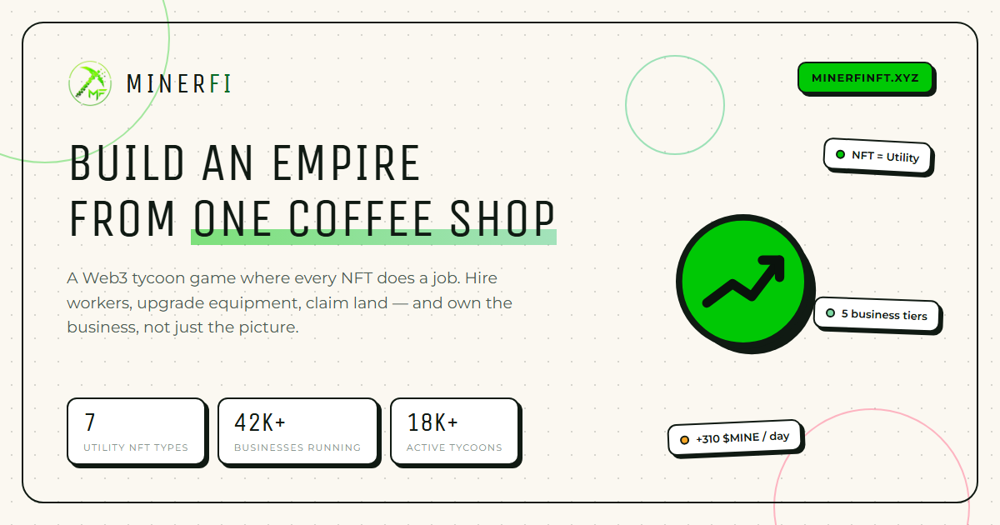

<div align="center">



# MinerFi

**A Web3 business tycoon game where the NFT *is* the business.**

[](https://minerfinft.xyz)
[](https://nextjs.org)
[](https://www.typescriptlang.org)
[](https://soliditylang.org)
[](https://docs.robinhood.com/chain)

[**Live site**](https://minerfinft.xyz) · [**Dashboard**](https://minerfinft.xyz/app) · [**Contracts**](#live-on-robinhood-testnet)

</div>

---

## What this is

Every deed is a running shop at one of five tiers, and the tier is what the
rewards contract reads to decide what its holder is owed. Buy a business, it
produces GOLD every second you hold it, claim whenever you like, sell whenever
you like.

Target chain: **Robinhood Chain** — an Arbitrum L2 using ETH for gas.
Mainnet is `4663`, testnet is `46630`.

## The three contracts

| Contract | What it is |
| --- | --- |
| `MinerFiNFT` | ERC-721 business deeds. Five tiers, on-chain SVG metadata, and a transfer hook that settles rewards before ownership moves. |
| `GoldToken` | ERC-20 GOLD. Minted only by the rewards contract, only at claim time. |
| `GoldRewards` | Accrual and claiming. `pending = (now − lastAccrual) × goldPerDay ÷ 1 day`. |

There is no staking and no reward pool. The deed stays in the holder's wallet,
stays listable, and earns the whole time — GOLD is minted at claim for exactly
the seconds that were actually held.

## The tier ladder

| # | Business | Price | GOLD / day | Max supply |
| --- | --- | --- | --- | --- |
| 1 | Coffee Shop | 0.05 ETH | 120 | 10,000 |
| 2 | Restaurant | 0.18 ETH | 480 | 5,000 |
| 3 | Hotel | 0.60 ETH | 1,750 | 2,000 |
| 4 | Corporation | 2.10 ETH | 6,400 | 500 |
| 5 | Global Empire | 7.50 ETH | 24,000 | 100 |

Prices above are the mainnet design. Every non-local deploy divides them by
`MINT_PRICE_DIVISOR` (default `1000`), so the whole ladder costs about 0.01 ETH
on testnet instead of 10. Set it to `1` for mainnet.

Tiers are configured at deploy time and adjustable afterwards by the owner via
`setTier`, so the ladder is data rather than a constant baked into bytecode.

## Live on Robinhood testnet

Chain `46630`, deployed at block 102,723,229.

| Contract | Address |
| --- | --- |
| `MinerFiNFT` | [`0x71f02c31…cea8231e`](https://explorer.testnet.chain.robinhood.com/address/0x71f02c31b2f7bc3c290ddabcb065f322cea8231e) |
| `GoldToken` | [`0x0726b251…c9f4d347`](https://explorer.testnet.chain.robinhood.com/address/0x0726b2510bd2b804179670a2deca2e08c9f4d347) |
| `GoldRewards` | [`0xa7397360…53943368`](https://explorer.testnet.chain.robinhood.com/address/0xa7397360e8f680225e77d66347c4dd2253943368) |

`src/lib/web3/deployments.json` is the source of truth the app reads at runtime.
Nothing else needs editing when contracts move — the frontend picks up whichever
chain has addresses recorded.

## Tech stack

| Layer | Choice |
| --- | --- |
| Framework | Next.js 16 (App Router) · React 19 · TypeScript |
| Styling | Tailwind CSS 4 · `motion` for animation · `lucide-react` |
| Chain access | wagmi 3 · viem 2 — `injected` connector only, so MetaMask, Rabby and Brave all work with no project id to register |
| Contracts | Solidity 0.8.36 · OpenZeppelin 5 · Hardhat for the local node |

## Project structure

```
contracts/            MinerFiNFT.sol, GoldToken.sol, GoldRewards.sol
scripts/              compile, deploy, preflight, verify-flow, new-deployer
                      plus the brand-asset cutters: make-logo-asset, generate-og
src/app/              routes: / (landing) and /app (dashboard)
src/components/       landing sections + ui/ primitives
src/components/web3/  wallet gate, mint panel, portfolio, tx status
src/lib/web3/         wagmi config, ABIs, hooks, deployments.json
```

## Run it locally

Three terminals:

```bash
npm run chain
```

```bash
npm run contracts:compile && npm run contracts:deploy
```

```bash
NEXT_PUBLIC_DEFAULT_CHAIN_ID=31337 npm run dev
```

That variable is the one piece of local setup that is not optional: the app
targets Robinhood Chain by default and will otherwise point past your local node
at a network with nothing deployed on it.

The deploy writes addresses to `src/lib/web3/deployments.json`, which is what
the app reads at runtime. Open
[localhost:3000/app](http://localhost:3000/app).

## Deploy to Robinhood Chain Testnet

First check the chain will take the contracts. This only reads, so it is safe
to run against anything:

```bash
RPC_URL=https://rpc.testnet.chain.robinhood.com npm run contracts:preflight
```

Then you need a deployer key with ETH on it. Robinhood's guide recommends a
throwaway rather than reusing a real wallet, so there is a command for it:

```bash
npm run deployer:new
```

It writes the key to `.env.deploy` without ever printing it, and shows you the
address to fund. Already have a funded testnet key? Put it in `.env.deploy` as
`DEPLOYER_PRIVATE_KEY` instead and skip this.

> **Not `.env`.** Next.js auto-loads `.env`, and Turbopack copies what it loads
> into `.next/cache` — a key there gets written verbatim into a build directory
> that ends up in Docker contexts and CI artifacts. Next.js does not recognise
> the name `.env.deploy`, so a key there never reaches the build. Both files are
> gitignored.

Then deploy:

```bash
RPC_URL=https://rpc.testnet.chain.robinhood.com npm run contracts:deploy
```

Then re-run the preflight — it now checks that both contracts are wired to each
other and that every read the dashboard makes actually decodes:

```bash
RPC_URL=https://rpc.testnet.chain.robinhood.com npm run contracts:preflight
```

Commit the updated `deployments.json` and the app points at Robinhood testnet on
the next build. Nothing else changes.

### Getting testnet ETH

Robinhood Chain publishes no faucet. Testnet ETH is bridged over from Ethereum —
see [their bridging docs](https://docs.robinhood.com/chain/bridging).

## Verify the economics

`verify-flow` exercises the real holder journey against a local chain and
asserts the numbers, so the UI is never the thing being trusted:

```bash
npm run contracts:verify-flow
```

It proves an investor can buy with ETH, that GOLD accrues at exactly the
advertised rate, that claiming mints it, and — the one place a design like this
could quietly cheat somebody — that selling settles correctly, with the seller
keeping what they earned and the buyer inheriting nothing.

## Environment

Everything is optional; see `.env.example`. The two worth knowing:

- `NEXT_PUBLIC_DEFAULT_CHAIN_ID` — the chain the app targets before a wallet is
  connected: the one it names when asking somebody to switch, and the one it
  reads from meanwhile. It defaults to Robinhood Chain and **never** to the local
  node, because "switch to my laptop" is not advice anyone can act on. Set it to
  `31337` when developing against `npm run chain`.
- `MINT_PRICE_DIVISOR` — deploy-time only, described above.

## Checks

```bash
npx tsc --noEmit && npx eslint src && npm run build
```

## Deploying the site

The frontend is a stock Next.js app — `npm run build && npm start`, port 3000,
no runtime secrets. [minerfinft.xyz](https://minerfinft.xyz) runs it behind nginx
as a reverse proxy with a Let's Encrypt certificate, kept alive by pm2.

## Scripts

| Command | What it does |
| --- | --- |
| `npm run dev` | Next dev server |
| `npm run build` / `start` | Production build and serve |
| `npm run lint` | ESLint |
| `npm run chain` | Local Hardhat node on `31337` |
| `npm run contracts:compile` | solc → `contracts/out/` |
| `npm run contracts:deploy` | Deploy all three, write `deployments.json` |
| `npm run contracts:preflight` | Pre- and post-deploy chain checks |
| `npm run contracts:verify-flow` | End-to-end economic assertions |
| `npm run deployer:new` | Generate a throwaway deployer into `.env.deploy` |

## License

The Solidity sources carry `SPDX-License-Identifier: MIT` headers. The
repository as a whole has no `LICENSE` file yet — add one before treating
anything here as reusable.
